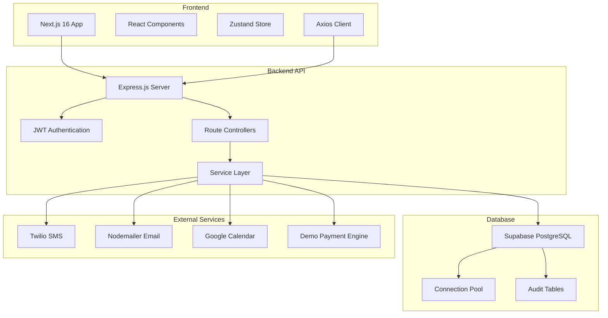

<div align="center">

# BookFlow

**A production-ready SaaS booking platform** — multi-tenant service scheduling, payments, notifications, and analytics in one deployable stack.

[](https://nodejs.org)
[](https://nextjs.org)
[](https://www.postgresql.org)
[](https://www.typescriptlang.org)
[](LICENSE)

[Live Demo](#) · [API Reference](#api-reference) · [Report a Bug](issues) · [Request a Feature](issues)

</div>

---

## Table of Contents

- [Overview](#overview)
- [Architecture](#architecture)
- [Features](#features)
- [Tech Stack](#tech-stack)
- [Project Structure](#project-structure)
- [Getting Started](#getting-started)
  - [Prerequisites](#prerequisites)
  - [Installation](#installation)
  - [Database Setup](#database-setup)
  - [Environment Variables](#environment-variables)
  - [Running Locally](#running-locally)
- [Available Scripts](#available-scripts)
- [API Reference](#api-reference)
- [Deployment](#deployment)
  - [Backend — Render](#backend--render)
  - [Frontend — Vercel](#frontend--vercel)
  - [Database — Supabase](#database--supabase)
- [Security](#security)
- [Monitoring & Logging](#monitoring--logging)
- [Contributing](#contributing)

---

## Overview

BookFlow is a full-stack SaaS platform that lets businesses offer online appointment and service booking to their customers. It ships with a complete authentication system, real-time availability management, **demo payment mode**, automated email/SMS reminders, Google Calendar sync, and a full admin dashboard with analytics — all production-hardened and ready to deploy.

The project is structured as a **monorepo** with two independently deployable applications:

| Application | Stack | Port |
|---|---|---|
| `server/` | Express 4 · Node.js ≥ 20 · PostgreSQL | `5000` |
| `client/` | Next.js 16 · React 19 · TypeScript | `3000` |

---

## Architecture

```
┌─────────────────────────────────────────────────────────────────┐
│                        Client (Browser)                         │
│              Next.js 16 · React 19 · TypeScript                 │
│   ┌──────────┐ ┌───────────┐ ┌──────────┐ ┌─────────────────┐  │
│   │ Landing  │ │ Booking   │ │Dashboard │ │  Admin Panel    │  │
│   │  Page    │ │  Flow     │ │ (User)   │ │  + Analytics    │  │
│   └──────────┘ └───────────┘ └──────────┘ └─────────────────┘  │
│          │  Axios + JWT Bearer  │  Zustand (global state)       │
└──────────┼───────────────────  ┼──────────────────────────────  ┘
           │  HTTPS + CORS        │
           ▼                      ▼
┌─────────────────────────────────────────────────────────────────┐
│                    Express API  (server/)                        │
│                                                                 │
│  ┌──────────┐  ┌──────────┐  ┌──────────┐  ┌───────────────┐  │
│  │  /auth   │  │/bookings │  │/services │  │ /admin        │  │
│  │  /users  │  │/payments │  │/avail.   │  │ /analytics    │  │
│  │          │  │/calendar │  │/recommend│  │               │  │
│  └──────────┘  └──────────┘  └──────────┘  └───────────────┘  │
│                                                                 │
│  Middleware: Helmet · HPP · Rate Limit · JWT Auth · Validator   │
│  Jobs: Cron reminders · Slot cleanup                            │
│  Logger: Winston · DailyRotateFile (error / combined / payment) │
└──────────────────────────┬──────────────────────────────────────┘
                           │
           ┌───────────────┼────────────────────┐
           ▼               ▼                    ▼
    ┌─────────────┐ ┌─────────────┐    ┌──────────────┐
    │ PostgreSQL  │ │   Stripe    │    │  3rd-Party   │
    │  (Supabase) │ │  Payments   │    │  Services    │
    │             │ │  Webhooks   │    │              │
    │ • bookings  │ └─────────────┘    │ • Nodemailer │
    │ • users     │                    │ • Twilio SMS │
    │ • services  │                    │ • Google Cal │
    │ • payments  │                    └──────────────┘
    └─────────────┘
```

---

## Features

### Customer-Facing
- **Service catalog** — browse available services with pricing, duration, and descriptions
- **Smart availability** — real-time slot availability with conflict prevention at the DB level (PostgreSQL `EXCLUDE` constraint)
- **Slot recommendations** — intelligent booking time suggestions based on history and patterns
- **Booking flow** — multi-step booking wizard with confirmation and cancellation
- **Demo payment mode** — realistic payment simulation with card inputs, loading states, and success flow
- **Email notifications** — booking confirmations, reminders, and cancellations via Nodemailer
- **SMS reminders** — automated appointment reminders via Twilio with user preferences
- **Google Calendar sync** — bookings pushed to Google Calendar via OAuth2

### Provider Dashboard
- **Booking management** — view, confirm, reschedule, and cancel bookings
- **Schedule control** — manage service availability and override specific dates
- **Payment tracking** — demo payment status and transaction records

### Admin Panel
- **Analytics dashboard** — revenue, booking volume, top services, cancellation rates
- **User management** — view, update, and deactivate customer accounts
- **Service management** — create, edit, and retire services with pricing tiers
- **System health** — real-time `/health` and `/ready` endpoints with DB latency

### Platform
- **JWT authentication** — short-lived access tokens (15 min) + rotating refresh tokens (7 days) stored as hashed values in the DB
- **Role-based access control** — `user`, `admin` roles enforced on every route
- **Production security** — HSTS, CSP, HPP, algorithm-pinned JWT, UUID param validation, rate limiting
- **Structured logging** — Winston with daily log rotation; separate audit log for booking events
- **Graceful shutdown** — SIGTERM/SIGINT handling that drains connections before exit

---

## Tech Stack

### Backend
| Category | Technology |
|---|---|
| Runtime | Node.js ≥ 20 |
| Framework | Express 4.19 |
| Database | PostgreSQL 14+ via `pg` pool |
| Authentication | `jsonwebtoken` (HS256) + bcryptjs (12 rounds) |
| Validation | express-validator |
| Payments | Demo payment mode (Stripe infrastructure ready) |
| Email | Nodemailer (SMTP) |
| SMS | Twilio |
| Calendar | Google Calendar API v3 |
| Scheduling | node-cron |
| Security | helmet · hpp · express-rate-limit · cookie-parser |
| Logging | Winston + winston-daily-rotate-file · Morgan |
| Testing | Jest + Supertest |

### Frontend
| Category | Technology |
|---|---|
| Framework | Next.js 16 (App Router) |
| Language | TypeScript 5.7 |
| UI Components | shadcn/ui · Radix UI primitives |
| Styling | Tailwind CSS |
| State Management | Zustand 5 |
| HTTP Client | Axios 1.13 (with JWT interceptor + 401 refresh queue) |
| Forms | react-hook-form + Zod |
| Animations | Framer Motion |
| Date handling | date-fns 4 |
| Package manager | pnpm 8+ |

### Infrastructure
| Category | Technology |
|---|---|
| Backend hosting | Render |
| Frontend hosting | Vercel |
| Database hosting | Supabase (or any PostgreSQL 14+ host) |
| Dev orchestration | concurrently |

---

## Project Structure

```
SaaS/
├── package.json              ← root scripts (dev, build, test, install:all)
├── DEVELOPMENT.md            ← detailed local setup guide
│
├── server/                   ← Express API
│   ├── server.js             ← entry point: middleware, routes, health probes, shutdown
│   ├── config/
│   │   ├── db.js             ← PostgreSQL pool (keepAlive, retry, min:2/max:20)
│   │   ├── database.js       ← re-export shim (backward compat)
│   │   ├── env.js            ← startup env validation — exits on missing secrets
│   │   ├── jwt.js            ← sign/verify helpers (algorithm pinned to HS256)
│   │   ├── logger.js         ← Winston: error / combined / payment log files
│   │   └── stripe.js         ← Stripe client singleton
│   ├── controllers/          ← request handlers (auth, bookings, payments, …)
│   ├── middleware/
│   │   ├── auth.js           ← authenticate · optionalAuth · authorize · requireAdmin
│   │   └── errorHandler.js   ← centralised error response + logging
│   ├── models/               ← SQL query wrappers (no ORM)
│   ├── routes/               ← route definitions mapped to controllers
│   ├── services/             ← external service wrappers (email, sms, calendar)
│   ├── jobs/                 ← cron jobs: reminder dispatch, slot cleanup
│   ├── db/
│   │   └── schema.sql        ← tables, indexes, EXCLUDE constraint, seed data
│   ├── .env.example          ← copy to .env and fill in values
│   └── render.yaml           ← Render IaC deploy config
│
└── client/                   ← Next.js 16 frontend
    ├── app/
    │   ├── page.tsx          ← landing page
    │   ├── login/ signup/    ← authentication pages
    │   ├── booking/          ← booking wizard
    │   ├── services/         ← public service catalog
    │   ├── dashboard/        ← provider dashboard (bookings, settings)
    │   └── admin/            ← admin panel (analytics, users, services)
    ├── components/
    │   ├── ui/               ← shadcn/ui primitives
    │   ├── landing/          ← marketing components
    │   ├── dashboard/        ← dashboard-specific components
    │   └── admin/            ← admin-specific components
    ├── lib/
    │   ├── api/              ← Axios API client modules (auth, bookings, …)
    │   ├── store.ts          ← Zustand store (auth slice + booking state)
    │   └── utils.ts          ← shared utilities
    └── .env.local.example    ← copy to .env.local
```

---

## Database Schema Overview

The platform uses PostgreSQL with the following core tables:

| Table | Purpose |
|---|---|
| `users` | User accounts, authentication, roles (user/admin), phone numbers |
| `services` | Bookable services with pricing, duration, and availability |
| `bookings` | Booking records with status, payment tracking, and calendar sync |
| `availability` | Time slot availability with overlap prevention |
| `booking_events` | Audit trail for all booking state changes |
| `refresh_tokens` | JWT refresh token storage for authentication |
| `google_tokens` | Google Calendar OAuth tokens for sync |
| `payment_sessions` | Payment transaction records (demo mode) |
| `payment_events` | Payment webhook events and processing |
| `calendar_sync_log` | Google Calendar synchronization history |
| `sms_logs` | SMS message logs and delivery status |
| `user_sms_preferences` | User SMS notification preferences |

**Key Features:**
- PostgreSQL `EXCLUDE` constraints prevent double-bookings
- UUID primary keys for security and scalability
- Full audit trails with timestamps
- Optimized indexes for performance

---

## API Endpoints

### Authentication
```
POST /api/auth/register    # User registration
POST /api/auth/login       # User login
POST /api/auth/refresh     # Token refresh
POST /api/auth/logout      # User logout
GET  /api/auth/me          # Get current user
```

### Services
```
GET    /api/services           # List all active services
GET    /api/services/:id       # Get service details
POST   /api/services           # Create service (admin)
PUT    /api/services/:id       # Update service (admin)
DELETE /api/services/:id       # Delete service (admin)
```

### Bookings
```
GET    /api/bookings           # List user bookings
POST   /api/bookings           # Create new booking
GET    /api/bookings/:id       # Get booking details
PUT    /api/bookings/:id       # Update booking
DELETE /api/bookings/:id       # Cancel booking
```

### Payments (Demo Mode)
```
POST   /api/payments/simulate          # Simulate payment processing
GET    /api/payments/status/:bookingId # Check payment status
POST   /api/payments/webhook           # Payment webhook handler
```

### Calendar Integration
```
GET    /api/calendar/oauth/url          # Get Google OAuth URL
GET    /api/calendar/oauth/callback    # OAuth callback handler
POST   /api/calendar/sync/:bookingId    # Sync booking to calendar
GET    /api/calendar/status            # Check connection status
```

### SMS Notifications
```
POST   /api/sms/send                   # Send custom SMS
GET    /api/sms/preferences             # Get SMS preferences
PUT    /api/sms/preferences             # Update SMS preferences
POST   /api/sms/booking/:id/confirm     # Send confirmation SMS
POST   /api/sms/booking/:id/reminder    # Send reminder SMS
GET    /api/sms/logs                    # Get SMS history
```

### Admin
```
GET    /api/admin/analytics            # Dashboard analytics
GET    /api/admin/users                 # User management
PUT    /api/admin/users/:id             # Update user
GET    /api/admin/bookings              # All bookings
POST   /api/admin/availability          # Manage availability
```

---

## Getting Started

### Prerequisites

Ensure the following are installed before proceeding:

| Tool | Version | Install |
|---|---|---|
| Node.js | ≥ 20 | [nodejs.org](https://nodejs.org) |
| npm | ≥ 9 | bundled with Node.js |
| pnpm | ≥ 8 | `npm install -g pnpm` |
| PostgreSQL | ≥ 14 | [postgresql.org](https://www.postgresql.org/download) |

### Installation

Clone the repository and install all dependencies in one step:

```bash
git clone https://github.com/your-username/bookflow.git
cd bookflow
npm run install:all
```

This installs:
1. Root-level tools (`concurrently`)
2. Backend dependencies (`server/node_modules`)
3. Frontend dependencies (`client/node_modules`)

### Database Setup

```bash
# Create the database
psql -U postgres -c "CREATE DATABASE saas_booking;"

# Apply schema — tables, indexes, constraints
psql -U postgres -d saas_booking -f server/db/schema.sql
```

> **Windows:** If `psql` is not in PATH, use the full path:
> `"C:\Program Files\PostgreSQL\16\bin\psql.exe"`

### Environment Variables

#### Backend — `server/.env`

Copy the example file and fill in your values:

```bash
cp server/.env.example server/.env
```

| Variable | Required | Description |
|---|---|---|
| `PORT` | No | Server port (default: `5000`) |
| `NODE_ENV` | Yes | `development` \| `production` \| `test` |
| `CORS_ORIGIN` | Yes | Frontend URL (e.g. `http://localhost:3002`) |
| `DATABASE_URL` | Yes* | Supabase PostgreSQL connection string |
| `DB_HOST` | Yes* | Postgres host (fallback if no DATABASE_URL) |
| `DB_PORT` | Yes* | Postgres port (`5432`) |
| `DB_NAME` | Yes* | Database name |
| `DB_USER` | Yes* | Postgres user |
| `DB_PASSWORD` | Yes* | Postgres password |
| `JWT_SECRET` | Yes | Random string ≥ 32 characters |
| `JWT_REFRESH_SECRET` | Yes | Different random string ≥ 32 characters |
| `JWT_EXPIRES_IN` | No | Access token TTL (default: `15m`) |
| `JWT_REFRESH_EXPIRES_IN` | No | Refresh token TTL (default: `7d`) |
| `STRIPE_SECRET_KEY` | No | Stripe secret key (infrastructure ready) |
| `STRIPE_WEBHOOK_SECRET` | No | Stripe webhook secret (infrastructure ready) |
| `SMTP_HOST` | No | SMTP server hostname |
| `SMTP_PORT` | No | SMTP port (usually `587`) |
| `SMTP_USER` | No | SMTP username / email address |
| `SMTP_PASS` | No | SMTP password / app password |
| `EMAIL_FROM` | No | Sender address for outgoing email |
| `TWILIO_ACCOUNT_SID` | No | Twilio account SID |
| `TWILIO_AUTH_TOKEN` | No | Twilio auth token |
| `TWILIO_PHONE_NUMBER` | No | Twilio sending number (`+1…`) |
| `GOOGLE_CLIENT_ID` | No | Google OAuth2 client ID |
| `GOOGLE_CLIENT_SECRET` | No | Google OAuth2 client secret |
| `GOOGLE_REDIRECT_URI` | No | OAuth2 callback URL |
| `TOKEN_ENCRYPTION_KEY` | No | 32-byte hex key for encrypting Google tokens |

\* Use either `DATABASE_URL` (Supabase / Render) **or** the individual `DB_*` variables — not both.

**Generate secure JWT secrets:**
```bash
node -e "console.log(require('crypto').randomBytes(32).toString('hex'))"
```
Run this command **twice** — once for `JWT_SECRET`, once for `JWT_REFRESH_SECRET`.

> Stripe, email, SMS, and Google Calendar are **optional** for local development. The server starts without them.

#### Frontend — `client/.env.local`

```bash
cp client/.env.local.example client/.env.local
```

```env
NEXT_PUBLIC_API_URL=http://localhost:5000
```

No other changes needed for local development.

### Running Locally

Start both servers simultaneously with colour-coded output:

```bash
npm run dev
```

| Output colour | Process | URL |
|---|---|---|
| Blue | Express API (nodemon, auto-reload) | http://localhost:5000 |
| Green | Next.js dev server (HMR) | http://localhost:3002 |

Press `Ctrl + C` to stop both processes.

**Verify your setup:**

```
http://localhost:3002              → BookFlow landing page
http://localhost:5000/health       → { "status": "ok", "uptime_seconds": … }
http://localhost:5000/ready        → { "status": "ok", "checks": { "database": … } }
```

---

## Architecture Overview



**Data Flow:**
1. **Frontend** → HTTP requests → **Backend API**
2. **Backend** → Business logic → **Database**
3. **Backend** → External APIs → **Services**
4. **Services** → Notifications → **Users**

---

## Running the Project

### Development Mode

Start both frontend and backend simultaneously:

```bash
npm run dev
```

This runs:
- Backend: `http://localhost:5000` (Express + nodemon)
- Frontend: `http://localhost:3002` (Next.js with HMR)

### Individual Services

```bash
# Backend only
npm run server

# Frontend only  
npm run client
```

### Production Mode

```bash
# Build and run both in production
npm run prod

# Or individually
npm run build
npm run start:server
npm run start:client
```

---

## Available Scripts

Run all commands from the **project root**:

| Command | Description |
|---|---|
| `npm run dev` | Start API + frontend simultaneously (development) |
| `npm run server` | Backend only — Express + nodemon with auto-reload |
| `npm run client` | Frontend only — Next.js with HMR |
| `npm run build` | Production build of the Next.js frontend |
| `npm run prod` | Build frontend then start both servers in production mode |
| `npm run start:server` | Start the Express API in production mode |
| `npm run start:client` | Start the Next.js server in production mode |
| `npm run test` | Run the backend Jest test suite |
| `npm run type-check` | TypeScript type check (frontend) |
| `npm run install:all` | Install all dependencies (root + server + client) |

---

## API Reference

All endpoints are prefixed with the base URL (`http://localhost:5000` in development).

### Authentication

| Method | Endpoint | Auth | Description |
|---|---|---|---|
| `POST` | `/api/auth/register` | — | Create a new account |
| `POST` | `/api/auth/login` | — | Log in, receive access + refresh tokens |
| `POST` | `/api/auth/refresh` | Cookie / Body | Rotate refresh token |
| `POST` | `/api/auth/logout` | Bearer | Invalidate refresh token |
| `GET` | `/api/auth/me` | Bearer | Get authenticated user profile |

### Bookings

| Method | Endpoint | Auth | Description |
|---|---|---|---|
| `GET` | `/api/bookings` | Bearer | List current user's bookings |
| `POST` | `/api/bookings` | Bearer | Create a booking |
| `GET` | `/api/bookings/:id` | Bearer | Get booking details |
| `PATCH` | `/api/bookings/:id/cancel` | Bearer | Cancel a booking |

### Services

| Method | Endpoint | Auth | Description |
|---|---|---|---|
| `GET` | `/api/services` | — | List all active services |
| `GET` | `/api/services/:id` | — | Get service details |

### Availability

| Method | Endpoint | Auth | Description |
|---|---|---|---|
| `GET` | `/api/availability` | — | Get available slots by service + date |
| `GET` | `/api/recommendations` | Bearer | Get AI-powered slot recommendations |

### Payments

| Method | Endpoint | Auth | Description |
|---|---|---|---|
| `POST` | `/api/payments/create-checkout` | Bearer | Create Stripe Checkout session |
| `POST` | `/api/payments/webhook` | Stripe Sig | Handle Stripe webhook events |
| `GET` | `/api/payments/history` | Bearer | List user payment history |

### Admin *(requires `admin` role)*

| Method | Endpoint | Description |
|---|---|---|
| `GET` | `/api/admin/bookings` | List all bookings with filters |
| `GET` | `/api/admin/users` | List all users with filters |
| `PATCH` | `/api/admin/users/:id` | Update user role or status |
| `GET` | `/api/admin/analytics` | Revenue and booking analytics |
| `POST` | `/api/admin/services` | Create a new service |
| `PATCH` | `/api/admin/services/:id` | Update a service |
| `DELETE` | `/api/admin/services/:id` | Soft-delete a service |

### Health

| Method | Endpoint | Description |
|---|---|---|
| `GET` | `/health` | Liveness probe — process is alive |
| `GET` | `/ready` | Readiness probe — DB connection verified |

---

## Testing the System

### Demo Payment Flow Test

1. **Create a booking**:
   ```bash
   curl -X POST http://localhost:5000/api/bookings \
     -H "Authorization: Bearer YOUR_JWT_TOKEN" \
     -H "Content-Type: application/json" \
     -d '{"service_id": "SERVICE_UUID", "booking_date": "2026-03-20", "start_time": "10:00"}'
   ```

2. **Simulate payment**:
   ```bash
   curl -X POST http://localhost:5000/api/payments/simulate \
     -H "Authorization: Bearer YOUR_JWT_TOKEN" \
     -H "Content-Type: application/json" \
     -d '{"bookingId": "BOOKING_UUID"}'
   ```

3. **Check payment status**:
   ```bash
   curl -X GET http://localhost:5000/api/payments/status/BOOKING_UUID \
     -H "Authorization: Bearer YOUR_JWT_TOKEN"
   ```

### Integration Testing

- **Email**: Configure SMTP and test booking confirmations
- **SMS**: Configure Twilio and test reminder notifications  
- **Calendar**: Connect Google Calendar and test event creation
- **Authentication**: Test JWT refresh flow and role-based access

### Health Checks

```bash
# Backend health
curl http://localhost:5000/health

# Database readiness
curl http://localhost:5000/ready

# Frontend accessibility
curl http://localhost:3002
```

---

## Deployment

The recommended stack is **Render** (API) + **Vercel** (frontend) + **Supabase** (PostgreSQL). All three offer free tiers.

### Database — Supabase

1. Create a project at [supabase.com](https://supabase.com)
2. Navigate to **Settings → Database** and copy the `DATABASE_URL` (connection pooler URL)
3. Open the **SQL Editor** and paste the contents of `fixed_supabase_schema.sql`, then run it

### Backend — Render

The repository includes a ready-to-use `server/render.yaml`:

1. Create a new **Web Service** on [render.com](https://render.com) connected to your repository
2. Render will auto-detect `render.yaml` — no manual configuration needed
3. Add the following environment variables in the Render dashboard:

```
NODE_ENV=production
DATABASE_URL=<your Supabase connection pooler URL>
JWT_SECRET=<generate with: node -e "console.log(require('crypto').randomBytes(32).toString('hex'))">
JWT_REFRESH_SECRET=<generate separately>
CORS_ORIGIN=https://your-vercel-app.vercel.app
STRIPE_SECRET_KEY=sk_live_...  # Optional - infrastructure ready
STRIPE_WEBHOOK_SECRET=whsec_...  # Optional - infrastructure ready
SMTP_HOST=smtp.gmail.com
SMTP_PORT=587
SMTP_USER=your-email@gmail.com
SMTP_PASS=your-app-password
EMAIL_FROM=noreply@yourdomain.com
TWILIO_ACCOUNT_SID=your_twilio_sid
TWILIO_AUTH_TOKEN=your_twilio_token
TWILIO_PHONE_NUMBER=+1234567890
GOOGLE_CLIENT_ID=your_google_client_id
GOOGLE_CLIENT_SECRET=your_google_client_secret
GOOGLE_REDIRECT_URI=https://your-render-app.onrender.com/api/calendar/oauth/callback
TOKEN_ENCRYPTION_KEY=<32-byte hex key>
```

4. Deploy and test the webhook endpoints (demo payments work without Stripe)

### Frontend — Vercel

```bash
# Install Vercel CLI (optional)
npm install -g vercel

# Deploy from project root
vercel --cwd client
```

Or connect the repository directly in the [Vercel dashboard](https://vercel.com/new):
- **Root directory:** `client`
- **Framework preset:** Next.js

Add this environment variable in Vercel project settings:
```
NEXT_PUBLIC_API_URL=https://your-render-app.onrender.com
```

### Production Checklist

- [ ] `NODE_ENV=production` set on the server
- [ ] `CORS_ORIGIN` set to the exact Vercel URL (no trailing slash)
- [ ] Both JWT secrets are ≥ 32 random characters and different from each other
- [ ] `DATABASE_URL` uses the **pooler** connection string (port 6543 on Supabase)
- [ ] Stripe webhook secret configured and pointing to `/api/payments/webhook`
- [ ] Stripe webhook events selected: `checkout.session.completed`, `payment_intent.payment_failed`, `charge.refunded`
- [ ] `SMTP_*` variables set for transactional email
- [ ] Health check path on Render set to `/health`

---

## Security

The platform implements an extensive set of security controls for production use.

| Concern | Mitigation |
|---|---|
| XSS / clickjacking | `helmet` with HSTS (1yr + preload), strict-origin Referrer-Policy, `X-Frame-Options: DENY` |
| JWT algorithm confusion (`alg:none` / RS256 downgrade) | `algorithms: ['HS256']` pinned in all `jwt.verify()` calls |
| HTTP Parameter Pollution | `hpp` middleware registered after body parsers |
| IP spoofing on rate limiter | `app.set('trust proxy', 1)` makes `req.ip` authoritative behind reverse proxies |
| Brute-force login | Auth rate limiter: 20 requests / 15 min with `skipSuccessfulRequests: true` |
| SQL injection | Parameterised queries via `pg` — no raw string interpolation |
| Double-booking | PostgreSQL `EXCLUDE` constraint on the `bookings` table (DB-level hard stop) |
| Weak secrets at startup | `config/env.js` validates all required vars at process start — exits immediately if missing |
| Insecure CORS in production | `config/env.js` warns on missing, wildcard, or localhost `CORS_ORIGIN` in production |
| Credentials in cookies | `HttpOnly` + `Secure` + `SameSite=Strict` on refresh token cookie |
| UUID parameter injection | All route params validated with express-validator `isUUID()` |
| Stripe webhook spoofing | Signature verified with `stripe.webhooks.constructEvent()` before any processing |

---

## Monitoring & Logging

### Log Files

Winston writes four rotating log destinations under `server/logs/`:

| File | Level filter | Retention | Purpose |
|---|---|---|---|
| `error-YYYY-MM-DD.log` | `error` only | 30 days | Exceptions and errors |
| `combined-YYYY-MM-DD.log` | All levels | 14 days | Full application log |
| `payment-YYYY-MM-DD.log` | `component: 'payment'` | 90 days | Financial audit trail |
| Console | All (dev) / `info`+ (prod) | — | Terminal output |

All logs are archived to `.gz` after rotation. The `payment-*` log is filtered server-side — only events from `webhookHandler.js` (tagged `component: 'payment'`) are written to it.

### Health Endpoints

**`GET /health`** — liveness probe (no I/O)
```json
{
  "status": "ok",
  "uptime_seconds": 3600,
  "timestamp": "2026-03-12T10:00:00.000Z"
}
```

**`GET /ready`** — readiness probe (verifies DB connection)
```json
{
  "status": "ok",
  "checks": {
    "database": {
      "status": "ok",
      "latency_ms": 4,
      "pool": { "total": 2, "idle": 2, "waiting": 0 }
    }
  },
  "uptime_seconds": 3600
}
```

Returns `503 Service Unavailable` if the DB query exceeds 3 seconds. Morgan access logs skip `/health` and `/ready` to prevent probe noise.

### Graceful Shutdown

On `SIGTERM` or `SIGINT`, the server:
1. Stops accepting new connections (`server.close()`)
2. Waits for in-flight requests to complete
3. Drains the PostgreSQL connection pool (`pool.end()`)
4. Exits with code `0`

A 30-second force-kill timer fires if shutdown stalls.

---

## Future Improvements

### Planned Enhancements
- **Real-time Updates** - WebSocket implementation for live booking updates
- **File Upload System** - Service images and document attachments
- **Advanced Analytics** - Business intelligence and reporting dashboard
- **Multi-tenant Support** - White-label solution for multiple businesses
- **Mobile App** - React Native mobile application
- **Video Integration** - Telemedicine/consultation video calls
- **Recurring Bookings** - Subscription-based appointment scheduling
- **Advanced Notifications** - Push notifications and in-app messaging

### Scalability Improvements
- **Redis Caching** - Session storage and API response caching
- **Microservices Architecture** - Split into specialized services
- **Queue System** - Background job processing with Bull/Agenda
- **CDN Integration** - Static asset optimization
- **Database Sharding** - Multi-region data distribution

---

## License

MIT License - see [LICENSE](LICENSE) file for details.

---

## Contributing

1. Fork the repository
2. Create a feature branch (`git checkout -b feature/amazing-feature`)
3. Commit your changes (`git commit -m 'Add amazing feature'`)
4. Push to the branch (`git push origin feature/amazing-feature`)
5. Open a Pull Request

---

## Support

For questions and support:
- 📧 Email: support@bookflow.com
- 🐛 Issues: [GitHub Issues](https://github.com/your-username/bookflow/issues)
- 📖 Documentation: [BookFlow Docs](https://docs.bookflow.com)

---

**Built with ❤️ for the SaaS community**
